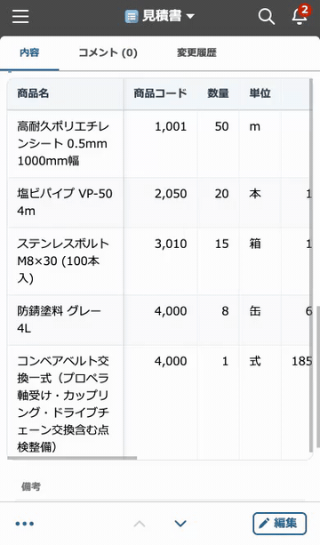

# モバイル表形式表示プラグイン（Mobile Table View for kintone）


kintone の **スマホ詳細（閲覧）画面**で、サブテーブル（テーブル）を見やすい **表形式**で表示するプラグインです。
標準のモバイル表示ではテーブルが縦に長く展開されて見づらいところを、横スクロール対応の表にして一覧性を高めます。



## 特徴

- サブテーブルを**表形式**で表示（標準の縦積み表示を置き換え）
- 画面からはみ出す列は**横スクロール**で確認
- 任意の列を**左に固定**（選んだ列は先頭に表示。横スクロールしても見失わない）
- 文字列列の**折り返し最大幅**を指定（長い商品名などが画面を占有しない）
- **ヘッダー行の固定**（縦スクロール時、任意）
- **表示する列の選択**（不要な検索用フィールド等を非表示）
- 数値・計算フィールドは**各フィールドの kintone 側表示設定**（桁区切り・単位・小数桁）どおりに表示
- **フィールドコードに非依存**。値は公式 API から取得し、表は自前 DOM で描画するため kintone の内部クラス名に依存せず壊れにくい

## 動作環境

- kintone（モバイル＝スマートフォン表示）
- サブテーブルを持つアプリ
- 設定画面の操作には、対象アプリのレコード閲覧権限（フォーム情報取得のため）

> 本プラグインは **詳細（閲覧）画面の表示のみ**を変更します。編集・追加画面には影響しません
> （kintone モバイルの編集画面はテーブルを縦積みでレンダリングするため、横並びの表にはできません）。

## インストール（利用者向け）

1. [Releases](../../releases) から `plugin.zip` をダウンロード
2. kintone の **システム設定 → その他 → プラグイン → 読み込む** で `plugin.zip` を追加
3. 対象アプリの **アプリの設定 → プラグイン** で本プラグインを追加
4. 歯車（設定）から、対象テーブル・固定する列などを設定して**保存**
5. **アプリを更新**し、スマホ（または PC ブラウザのスマホ表示）で詳細画面を確認

## 設定（アプリ設定画面）

| 設定 | 内容 |
| --- | --- |
| テーブルごと：対象にする | そのテーブルを表形式にするか |
| テーブルごと：固定する列 | 横スクロール時に左へ固定する列を選択（「固定しない」も可）。**選んだ列は先頭に表示**される |
| テーブルごと：ヘッダー行を固定 | 縦スクロール時に見出し行を固定（表領域を縦スクロール化） |
| テーブルごと：折返し最大幅(vw) | 文字列列の折り返し幅。長い文字列で列が画面を占有するのを防ぐ |
| テーブルごと：表示する列 | 表示する列を選択（すべてチェックで全列表示） |

> 数値・計算フィールドは、各フィールドの **kintone 側の表示設定（桁区切り・単位・小数の桁数）どおり**に表示します（プラグイン側に数値書式の設定項目はありません）。

## 対応フィールド

テーブル（サブテーブル）に配置できる全フィールド型に対応しています。

| フィールド型 | 表示 |
| --- | --- |
| 文字列（1行）/ ドロップダウン / ラジオボタン | テキスト |
| 文字列（複数行） | 改行を保持して表示 |
| リッチエディター | プレーンテキスト化して表示 |
| 数値 / 計算 | kintone の表示設定（桁区切り・単位・小数桁）に従う・右揃え |
| 日付 / 時刻 | そのまま表示 |
| 日時 | 端末ローカル時刻で `YYYY-MM-DD HH:mm` 表示 |
| チェックボックス / 複数選択 | 「、」区切りで列挙 |
| ユーザー / 組織 / グループ選択 | 名前を「、」区切りで列挙 |
| リンク | クリック可能なリンク（メール・電話は自動判定） |
| 添付ファイル | ファイル名のダウンロードリンク |
| ルックアップ | 参照先の実体型に従って表示 |

> リッチエディターは安全のため `DOMParser` でタグを除去してテキスト表示します（HTML は描画しません）。リンクは `javascript:` などの危険なスキームを無効化します。

## ソースからビルド（開発者向け）

### 前提

- Node.js 18 以上

### 手順

```bash
# 依存をインストール
npm install

# 初回ビルド（署名用の秘密鍵が無い場合）
#   → dist/plugin.zip と <プラグインID>.ppk が生成されます
npm run build:first
mv *.ppk private.ppk        # 生成された鍵を private.ppk として保管

# 2回目以降（private.ppk を使い、同一プラグインIDを維持）
npm run build
```

生成物は `dist/plugin.zip` です。これを kintone に読み込む／Releases に添付して配布します。

### 🔑 秘密鍵（`private.ppk`）の取り扱い

- `private.ppk` は**プラグインIDを決める署名鍵**です。`.gitignore` 済みで、**絶対に公開リポジトリへコミットしないでください**。
- 既存利用者が「同じプラグインの更新版」として受け取れるよう、**公式リリースは常に同じ `private.ppk` で署名**してください。
- 鍵を紛失すると同一IDで更新できなくなり、利用者は入れ直しになります。安全な場所にバックアップしてください。

## ディレクトリ構成

```
mobile-table-plugin/
├── manifest.json      … プラグイン定義（mobile.js / 設定画面を登録）
├── config.html        … 設定画面の HTML
├── css/config.css     … 設定画面のスタイル
├── image/icon.png     … プラグインアイコン（48×48）
├── js/
│   ├── config.js      … 設定画面ロジック（サブテーブル一覧・列順・書式の取得と保存）
│   └── mobile.js      … スマホ実行本体（表形式描画）
├── docs/demo.gif      … README 用デモGIF（横スクロール・ループ）
├── package.json       … ビルドスクリプト
├── LICENSE            … MIT
└── .gitignore
```

## 仕組み / 設計メモ

- 設定値は `get/setConfig` が「文字列の Key-Value」しか保存できないため、すべて **`config` という 1 キーに JSON 文字列**でまとめて保存しています。
- 設定画面で `form/fields.json`（ラベル・数値書式）と `form/layout.json`（列の並び順）を取得し、必要な情報を設定に保存します。これにより実行時の API 呼び出しは不要です。
- 描画は `mobile.app.record.detail.show` イベントで行い、**列順は常にレコードのフィールド順（フォーム順）**に従います。
- 値は公式 API（`record`）から取得し、表は自前 DOM で描画するため、kintone モバイルの内部クラス名にほぼ依存しません。

## 制限事項 / 既知の注意点

- 編集・追加画面には適用されません（上記の理由による）。
- 詳細画面のサブテーブル検出は「DOM の出現順＝レコードのフィールド順」を前提としています（通常は一致）。万一一致しない場合は安全のため描画をスキップします。
- 数値の表示はフィールド設定に依存するため、表示を変えたい場合は kintone 側のフィールド設定（桁区切り表示・単位・小数桁）を調整してください。

## コントリビュート

Issue / Pull Request を歓迎します。バグ報告の際は、対象フィールド構成や再現手順、可能であればスクリーンショットを添えていただけると助かります。

## ライセンス

[MIT](LICENSE) © 2026 w-baby-y
